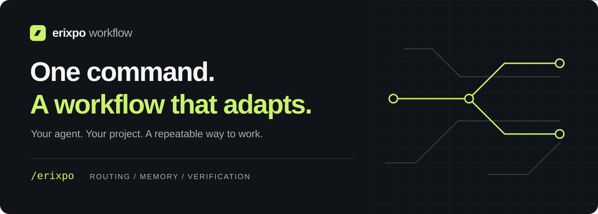
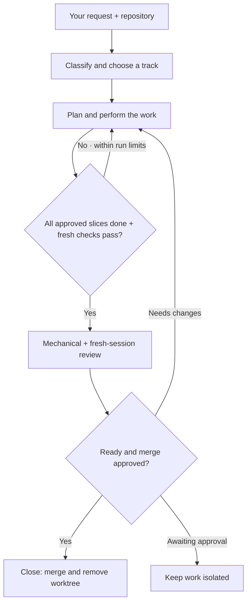

<p align="center">
  
</p>

<p align="center">
  Structured workflows, persistent project memory, and verification gates for your AI agent.<br />
  Describe the work. Let <code>/erixpo</code> find the right track.
</p>

<p align="center">
  <a href="https://github.com/erixpo/erixpo-workflow/actions/workflows/validate.yml"></a>
  <a href="VERSION"></a>
  <a href="LICENSE"></a>
</p>

<p align="center">
  <a href="#quick-start">Quick start</a> ·
  <a href="#how-it-works">How it works</a> ·
  <a href="#agent-compatibility">Compatibility</a> ·
  <a href="INSTALL.md">Installation guide</a> ·
  <a href="ROADMAP.md">Roadmap</a>
</p>

## Give your agent a repeatable way to work

**erixpo workflow** is a portable skill pack, installer, and command-line runner. It reads the repository and your request, then routes the agent to the appropriate workflow: build, fix, review, UI, research, writing, or operations.

Use it for an existing codebase, a new native app, a website, a script, or a folder of documents. The workflow adapts to the project; your agent supplies the model and tools.

| Capability | What it means for your work |
|---|---|
| **Context-aware routing** | A broken login, a design change, and a review request follow different tracks. |
| **Persistent memory** | Plans, preferences, lessons, and session history live in files the next session can read. |
| **Verification gates** | The unattended runner executes your project's check command after each worker iteration. |
| **Isolated work** | Unattended runs create a sibling Git worktree by default. Review and approved merging follow separately. |
| **Surface-aware guidance** | Research and scaffolding follow the actual platform and tools available on the machine. |

## Quick start

You need **Git, Bash, Python 3.9+**, and an agent capable of reading `SKILL.md` instructions. Unattended runs also need an installed, authenticated worker CLI and a Git repository. Your agent's usage costs still apply.

Run this **from the project you want to work on**, using a fresh temporary checkout:

```bash
erixpo_pack="$(mktemp -d "${TMPDIR:-/tmp}/erixpo-workflow.XXXXXX")"
git clone https://github.com/erixpo/erixpo-workflow.git "$erixpo_pack"
bash "$erixpo_pack/install.sh" --host auto
```

Then ask your agent:

```text
/erixpo
```

The initialization track profiles the project and establishes its working instructions. Follow with a request:

```text
/erixpo login is broken
```

The fix track calls for reproducing the problem, adding a regression test, applying a focused fix, and running checks. This is an example request, not a recorded execution.

The installer writes shared skills to `.agents/skills/` and adds the detected host's skill folder. If detection picks the wrong host, pass an explicit value such as `--host codex` or `--host claude`. Slash-command discovery depends on the host; if `/erixpo` is unavailable, ask the agent to read `.agents/skills/erixpo/SKILL.md` and follow it.

<details>
<summary><strong>Claude Code plugin installation</strong></summary>

In Claude Code:

```text
/plugin marketplace add erixpo/erixpo-workflow
/plugin install erixpo-workflow@erixpo-workflow
```

The marketplace name is defined in [marketplace.json](.claude-plugin/marketplace.json). For the project-local runner and engine files, use the installer above as well.

</details>

<details>
<summary><strong>Global skills and additional hosts</strong></summary>

Using the same temporary checkout from the quick start:

```bash
bash "$erixpo_pack/install.sh" --global --host codex
```

`--global` installs home skill folders and the engine under `~/.erixpo/` without changing the current project. Use `~/.erixpo/bin/erixpo --root /path/to/project <command>` for the global runtime; global uninstall is symmetric.

Add another host to that project:

```bash
bash "$erixpo_pack/install.sh" --expand --host claude
```

See the [installation guide](INSTALL.md) for paths, updates, and removal.

</details>

## How it works

Skills guide the agent's decisions. The runtime follows approved slices, executes independent checks, records evidence and outcomes, and bounds unattended execution. A passing baseline cannot complete a plan that still has unfinished slices.



This diagram describes the intended development workflow. Non-code tasks use the relevant work track and verification criteria. The runner stops successfully only when all approved slices are complete and their configured checks plus the project check pass after successful worker execution. It does not perform fresh-session review or obtain merge approval.

> **Passing checks is a checkpoint.** The workflow requires the relevant tests and a two-stage review before shipping. You decide when to merge. A worktree isolates Git changes; it is not a security sandbox.

## One command, different tracks

| What you ask | Where it goes |
|---|---|
| `/erixpo I want a SwiftUI app` | New project: research the surface and scaffold it |
| `/erixpo add share with friend` | Feature implementation |
| `/erixpo login is broken` | Fix with a regression test |
| `/erixpo look at the checkout` | Two-stage review |
| `/erixpo make the blue calmer` | UI token changes |
| `/erixpo replace the sidebar with tabs` | UI composition changes |
| `/erixpo draft a weekly status from documents/` | General work |
| `/erixpo what did we decide about checkout` | Session search |
| `/erixpo remember we never commit .env.local` | Persistent learning |
| `/erixpo continue` | Continue the autonomous workflow |
| `/erixpo update` | Update the workflow pack |
| `/erixpo I don't want erixpo anymore` | Guided uninstall |

## Agent compatibility

The installer contains the following host mappings and worker adapters. **An available adapter is not a guarantee of compatibility with every version of a vendor CLI.** The host must support reading the skills, and unattended workers must be installed and authenticated.

| Agent | Installer skill destination¹ | Unattended worker |
|---|---|---|
| Claude Code | `.claude/skills/` | `--worker claude` |
| Codex | `.codex/skills/` | `--worker codex` |
| Cursor | `.cursor/skills/` | `--worker cursor` (uses `agent`) |
| Gemini CLI | `.gemini/skills/` | `--worker gemini` |
| OpenCode | `.opencode/skills/` | `--worker opencode` |
| Hermes | `.agents/skills/` | `--worker hermes` |
| GitHub Copilot | `.github/skills/` | No dedicated adapter |
| Windsurf / Cline | `.windsurf/skills/` / `.cline/skills/` | No dedicated adapter |
| Crush / Aider / other hosts | `.agents/skills/` | Generic adapter² |

¹ Project installs also include `.agents/skills/`. These paths describe installer behavior, not independently verified native discovery in every host.

² `--worker generic` uses `ERIXPO_WORKER_CMD` when configured, otherwise tries Claude and then Codex. See [adapters/](adapters/) and [install.sh](install.sh) for the exact implementation.

## Run, review, and close

After initialization, ensure `.erixpo/plan.md` has `status: approved` and explicit slice Status fields or acceptance checkboxes and `.erixpo/stack.md` contains a runnable one-line `check:` command. The quality of that check determines what the runner can verify.

```bash
# Start an isolated run, capped at 20 iterations.
.erixpo/bin/erixpo run --worker claude --max 20 --timeout 3600
```

The runner prints the worktree path and ID. In that worktree, run the mechanical review:

```bash
.erixpo/bin/erixpo review --stage 1
```

Then open a **fresh agent session in the same worktree** and ask `/erixpo review` for stage two. Once the review says `ship` and you approve the merge, return to the original checkout:

```bash
# Replace s-… with the actual worktree ID.
.erixpo/bin/erixpo close --id s-…
```

`close` merges locally and removes the worktree and branch by default; it does not push. The runner also stops on its iteration/wall-time cap, three consecutive worker or check failures, or three iterations without slice progress. State and verification receipts explain why it stopped. Close refuses dirty or running trees, requires reviews bound to the current artifact, and preserves durable memory before removal.

<details>
<summary><strong>Inspection and cleanup commands</strong></summary>

```bash
.erixpo/bin/erixpo status
.erixpo/bin/erixpo worktrees
.erixpo/bin/erixpo sweep          # report leftovers
.erixpo/bin/erixpo sweep --apply  # clean eligible leftovers
.erixpo/bin/erixpo classify "look at checkout"
.erixpo/bin/erixpo capabilities
```

For research intensity hints:

```bash
.erixpo/bin/erixpo research-scope --class new
```

See `.erixpo/bin/erixpo --help` and the [worktree protocol](skills/erixpo/references/worktrees.md) for advanced options.

</details>

## Memory stays with the project

Working state lives under `.erixpo/`: the plan, stack/check command, user preferences, lessons, and session history. Project documentation is organized under `documents/` when initialized by the workflow.

This gives later sessions files to consult. It does not depend on the model retaining the previous conversation. Treat `.erixpo/` as generated local state and keep it out of version control in consuming projects; see [installation footprint](INSTALL.md#project-install).

## Project status and documentation

[VERSION](VERSION) is the source of truth for the pack version. Compare it with `.erixpo/VERSION` in an installed project, or ask `/erixpo update` to update the pack.

Iteration and wall-time budgets are implemented. GitHub issue-to-plan integration, stronger execution sandboxing, and automated visual review are future work. See the [roadmap](ROADMAP.md).

| Resource | What you'll find |
|---|---|
| [Installation](INSTALL.md) | Host selection, footprint, updates, and removal |
| [Changelog](CHANGELOG.md) | Release notes |
| [Roadmap](ROADMAP.md) | Current direction and planned work |
| [Contributing](CONTRIBUTING.md) | How to contribute and run `bash check.sh` |
| [Security](SECURITY.md) | Reporting security issues |
| [License](LICENSE) | MIT |

## Reliability and evaluation

Requirements: Bash, Git, Python 3.9+, macOS/Linux. See [installation and ownership](INSTALL.md) and [adapter support](adapters/README.md) for what is tested. Provider command contracts are tested with fake executables; live provider compatibility is not certified.

`bash check.sh` runs installed lifecycle regressions and fixture checks. The [paired evaluation suite](examples/evaluations/README.md) can compare the same configured model with and without erixpo. No live model performance claim is made until those trials are run and scored.

One-shot writing/research artifacts can stay lightweight without initialization. Recurring projects gain persistent context as needed. Research targets unknown or stale decisions and reuses verified version-matched sources.
